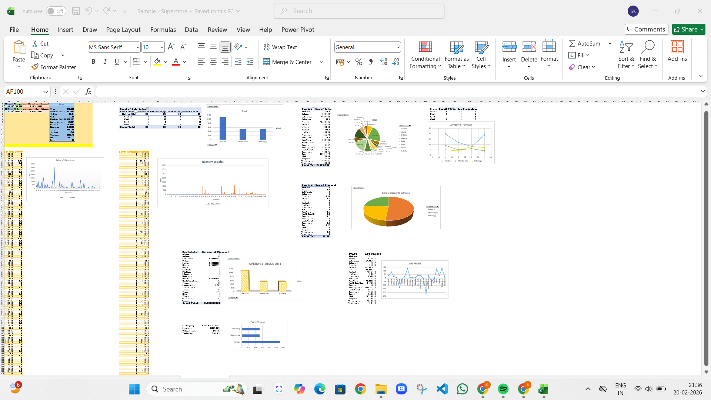
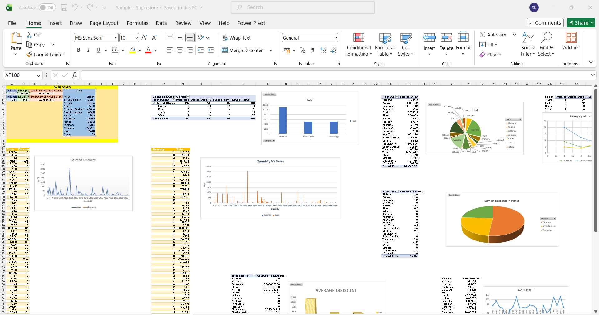

# superstore-sales-dataset-analysis
Excel-based sales data analysis using Superstore dataset with business insights.
# Superstore Sales Analysis (Excel Project)

## 📌 Project Objective
To analyze sales performance, profit trends, and discount impact using the Superstore dataset in Microsoft Excel.

## Dataset
The dataset contains:
- Orders data
- Product categories
- Regional information
- Returns data

## Tools Used
- Microsoft Excel
- Pivot Tables
- Charts
- KPI Dashboard
- Correlation Analysis

## Key Business Insights
- Technology category generated highest sales
- High discount rates reduced overall profitability
- Certain regions showed consistent losses
- Sales and discount show measurable correlation

## Dashboard Preview

## 🎯 Skills Demonstrated
- Data Cleaning
- Exploratory Data Analysis
- Business Interpretation
- Dashboard Design
- Analytical Thinking
