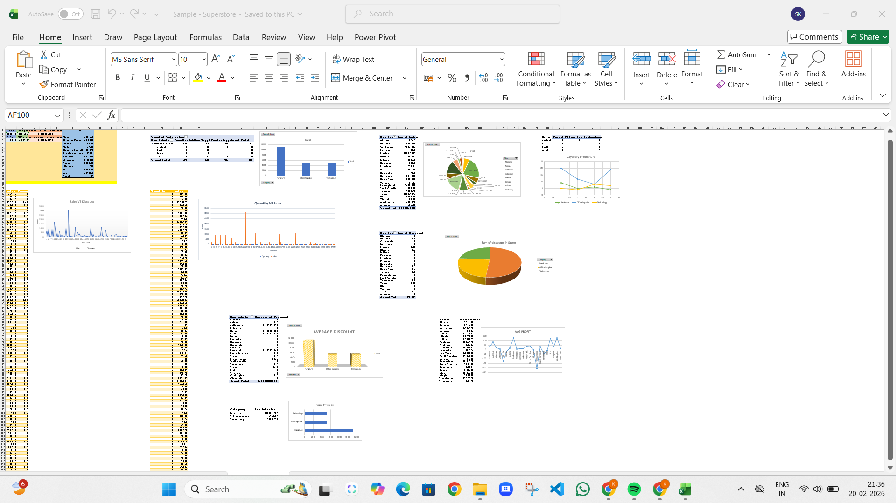

# Superstore Sales Analysis

End-to-end retail analytics project: from raw sales data to a star-schema data model to an interactive Power BI dashboard.

## 📊 Overview
This project analyzes a multi-year retail Superstore dataset to uncover trends in revenue, profit, discounts, and delivery performance, and presents the findings through KPI-driven dashboards for stakeholder reporting.

## 🧱 Approach
1. **Data Cleaning & EDA** — Cleaned raw transactional data and explored patterns in sales, profit, and delivery delays (Excel).
2. **Data Modeling** — Designed a star-schema model with fact and dimension tables to support scalable, repeatable reporting.
3. **Dashboarding** — Built an interactive Power BI dashboard with DAX measures for Total Revenue, Profit Margin, and Top Customers.
4. **Insight Generation** — Identified state-wise performance trends (California, Texas, Florida) and their relationship to discounting and delivery delays.

## 🖼️ Dashboard Preview

```



```

## 🛠️ Tech Stack
Power BI · DAX · Power Query · Excel

## 📁 Structure
```
superstore-sales-analysis/
├── data/                  # raw and cleaned datasets
├── star-schema-model/     # fact & dimension table design
├── dashboard/             # .pbix file
├── images/                # dashboard screenshots
└── README.md
```

## 🔑 Key Findings
- Technology category generated highest sales
- High discount rates reduced overall profitability
- Certain regions showed consistent losses
- Sales and discount show measurable correlation

## 🚀 How to View
1. Clone this repo
2. Open `dashboard/superstore.pbix` in Power BI Desktop
3. Refresh data connections if prompted

---
*This project consolidates what were previously three separate repos (sales dashboard, Excel analysis, and star-schema model) into a single end-to-end pipeline.*
